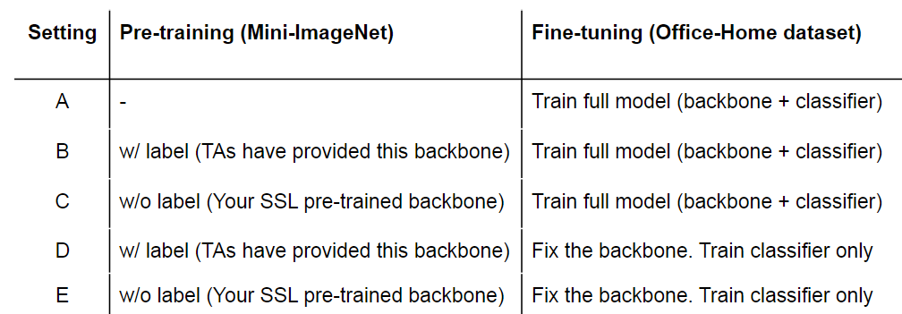
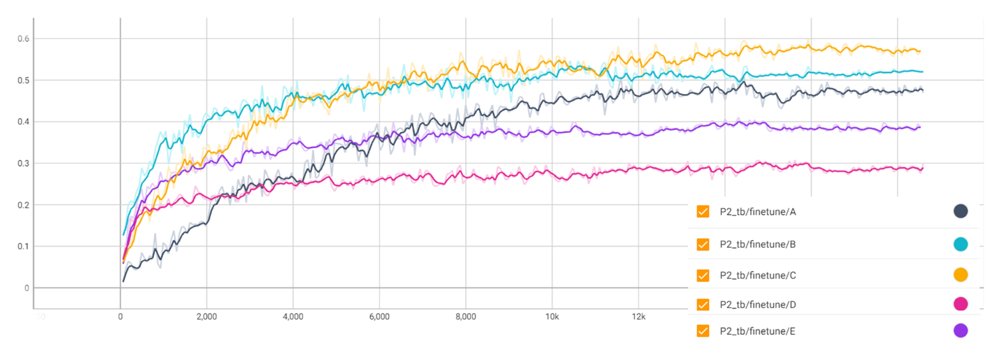

# Self-Supervised Pretraining for Image Classification

The code is borrowed from [byol-pytorch](https://github.com/lucidrains/byol-pytorch)

Performs SSL backbone pretraining on Mini-Imagenet, then transfered to Office-Home dataset with five different settings

See problem 2 in [Report.pdf](./Report.pdf) and [Spec.pdf](Spec.pdf)  more details.
